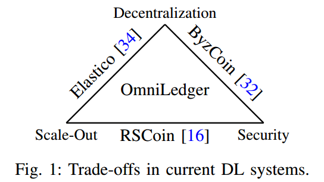
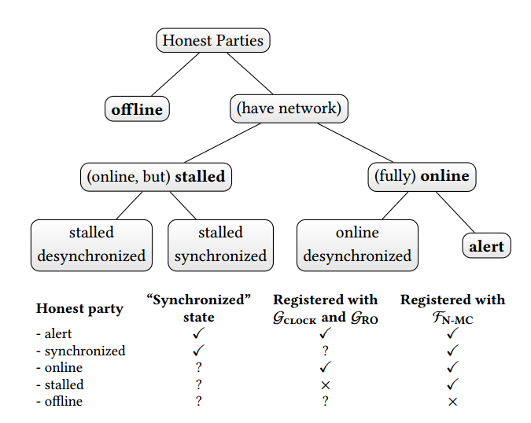

# 论文整理
## 区块链

**[2019] Monoxide: Scale out Blockchains with Asynchronous Consensus Zones**  
在保持系统安全性和去中心化程度的同时，提高系统吞吐量，从而提高可用性和扩展性（scalability）
* asynchronous consensus zones
    异步共识分区，建立多个swarms，各区区内事务互相独立，跨区事务仅发送给目标区
* cross-zone atomicity
    保证最终一致性，BASE（牺牲一定的一致性，换取更高的可用性）
* effective mining power amplification
    *Chu-ku-no Mining*，鼓励矿工在不同的区，用同一个pow计算结果创建区块 
* * *

**[2018] OmniLedger: A Secure, Scale-Out, Decentralized Ledger via Sharding**  
  
关键设计点：
* 定期选择具有统计代表性的验证器组；
* shard定期重组，以降低被破坏的可能性；- *RandHound*
* 拜占庭共识协议，ByzCoinX
* Atomix：两阶段客户端驱动协议，保证处理跨碎片事务的原子性 commit/abort atomically
* distributed checkpoint principle - state blocks
* 降低延迟：trust-but-verify验证，两层结构，第一层快速处理事务，第二层验证第一层事务的正确性。客户根据交易面额选择是否等待第二层处理完毕
* * *

**[2016] A Secure Sharding Protocol For Open Blockchains**  
比特币采取的pow共识机制，TPS仅有7，需要对系统吞吐量进行扩展。
传统拜占庭协议应用于非许可型区块链的局限：开放环境不存在预先建立的身份和公钥基础设施；bandwidth limit，用户越多，表现越差。
> Our goal is to seek a protocol for the open, permissionless network wherein participating processors have no pre-established identities, and where the transaction throughput scales.   
* 提出 *ELASTICO* 协议，容忍小于1/4的恶意节点
* 划分网络为更小的委员会（committees），各自处理平行事务—一个碎片shard
* 每个委员会包含足够少的节点，以运行经典拜占庭共识协议
* 流程：处理器本地用公钥、IP地址、pow问题解答生成自己的身份，根据处理器的身份，自动将它们分配到委员会中；同一委员会中的处理器互相交流身份；委员会内部运行PBFT共识协议；final committee根据各个委员会的结果，计算最终结果；final committee生成随机数集，用于下一轮的pow问题
* * *

**[2018] RapidChain: Scaling Blockchain via Full Sharding**  
sharding-based区块链目前存在的问题：吞吐量、扩展性和延迟表现还可以进一步提升，安全性不够高。
现存拜占庭协议用于成员固定的封闭环境，仅对静态敌手模型安全，不适于公有链。
比特币存在的问题：低吞吐量，高延迟，低能效，挖矿中心化，节点完整备份。
* 提出 *RapidChain*，容忍小于1/3的恶意节点
* 将节点划分为委员会（committees），委员会处理平行事务，各自保存独立的账本
* committee-election协议抽样出reference comittee，Cr
* peer-discovery算法帮助同一委员会下的节点发现对方；内部路由协议对于事务tx，输出处理tx的委员会Cout
* 跨区验证：同一委员会的节点将事务打包进区块，放进账本之前，要和input committees验证事务是否存在
* 内部共识：选举一个local leader；leader通过一个fast gossiping protocol将区块发给成员；最后应用基于Ren的一个拜占庭共识协议达成共识
* 每轮（epoch）结束之后，进入重置阶段，基于Cuckoo协议进行部分重新配置，重新生成成员名单和分配委员会
* 参与下一轮的节点，需在限制时间内向Cr提交自己的公钥和pow问题的解答。
* * *

## 数据存储
**Town Crier: An Authenticated Data Feed for Smart Contracts**

## 协议
**[2018] Ouroboros Genesis: Composable Proof-of-Stake Blockchains with Dynamic Availability**
> We present a novel Proof-of-Stake (PoS) protocol, Ouroboros Genesis, that enables parties 
to safely join (or rejoin) the protocol execution using only the genesis block 
information.

传统PoS协议，要求加入方获取一个可信的检查点区块（checkpoint block）/经常在线/可以获取一个在线节点数的准确估计。"bootstrap from genesis"是PoW相对于PoS的一个重要优势。
* dynamic availability （如比特币面对拜占庭敌手仍然健壮，即使节点任意加入、离开或掉线），各方随时可能产生和加入网络；随时可能掉线/重新在线；随时可能失去/获取random oracle和计时功能。
* 各方加入正在运行的区块链只需要创世区块的信息。
* alert：在足够长的时间内保持正常。active：alert + adversarial。stalled parties：没有掉线，但是失去clock和random oracle同步。

* * *

**[2017] Algorand: Scaling Byzantine Agreements for Cryptocurrencies**
解决问题：在低延迟的情况下，保证交易的安全性。（比特币：使用pow，最长链合法。为了减少分叉问题，创建一个区块约10分钟，几个区块过后才能确认交易）
* 交易延迟仅1分钟；所有用户（包括恶意节点），对已经确认的事务达成一致
* *Verifiable Random Functions*： 以私密和非交互的方式，选择参与下一轮的用户
* *BA⭐*：共识协议，选择提议阶段产生的区块中最具优先级且被一直认可的区块确定下来添加到区块链上。
* 警惕女巫攻击（攻击者大量使用匿名身份）；扩展到百万数量级的用户；抵御dos攻击，用户掉线也能正常运行
Techniques：
* weighted users - 根据stake为每个用户分配权重。只要诚实用户掌握超过2/3的钱，则系统安全
* consensus by committe - 随机选取一小撮成员组成委员会，执行协议的每一步
* cryptographic sortition - 为了防止针对委员会的攻击，使用VRFs进行选取。每个用户用自己的私钥和公开信息进行运算，选中的成员获得一串证明自己委员会身份的字符串
* participant replacement - 委员会每个成员只发言一次，每一步重新选举委员会
* * *

## 其他